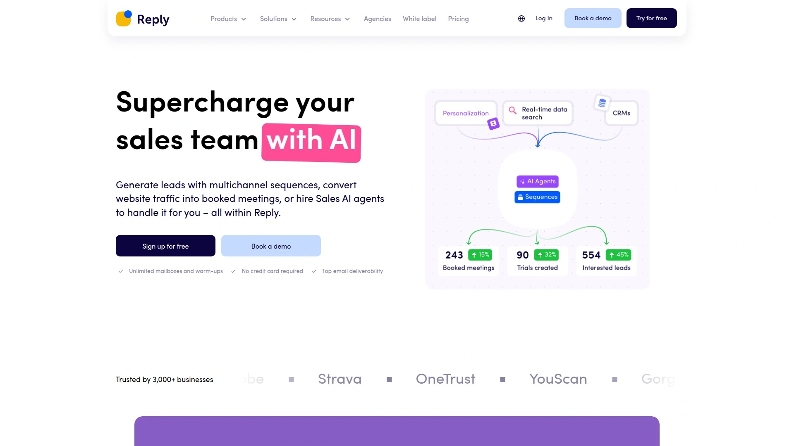
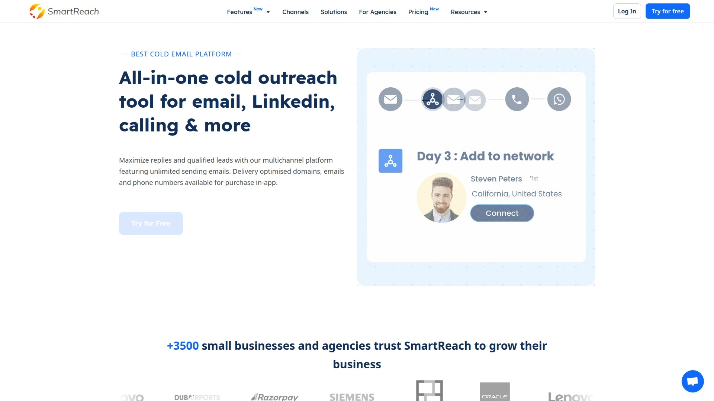
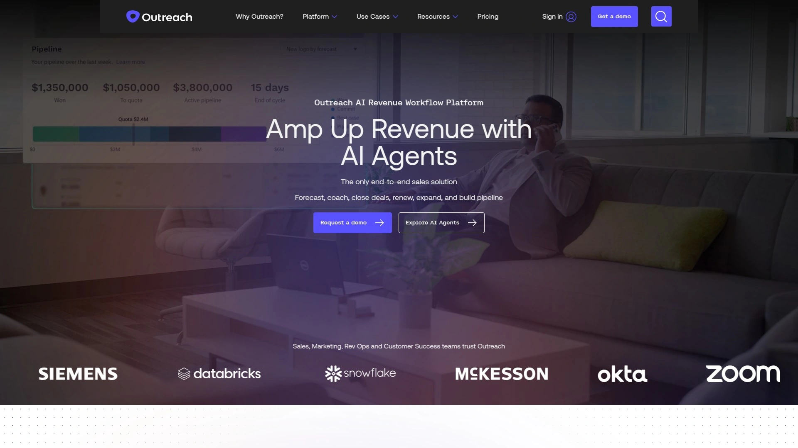
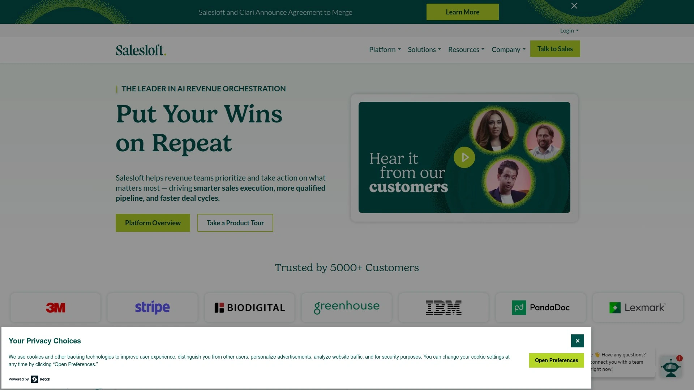
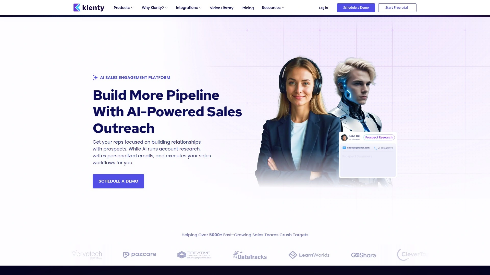
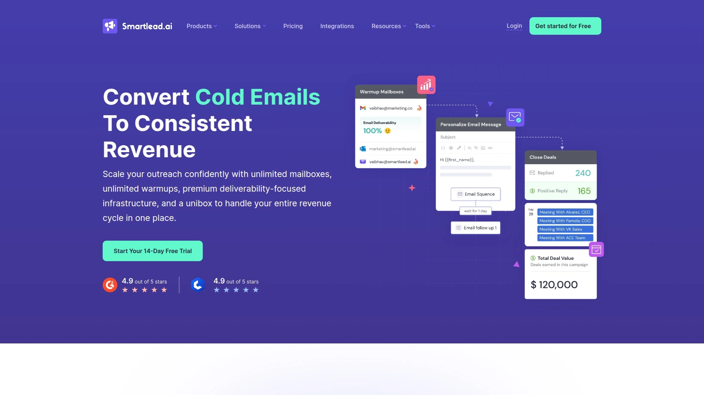
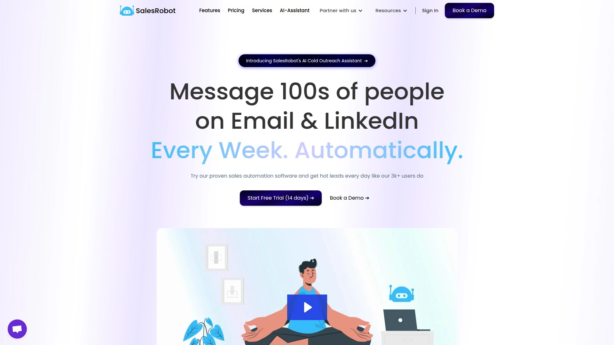
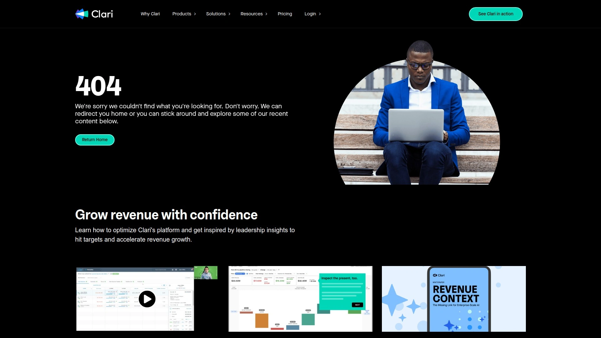
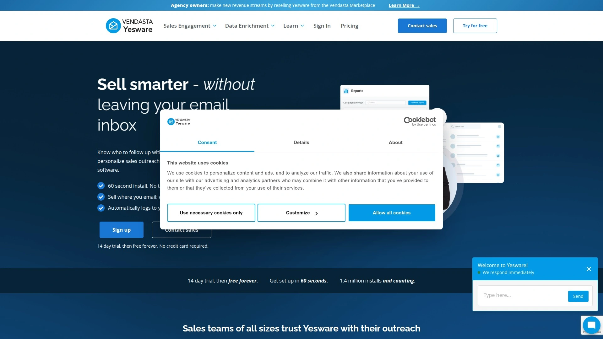
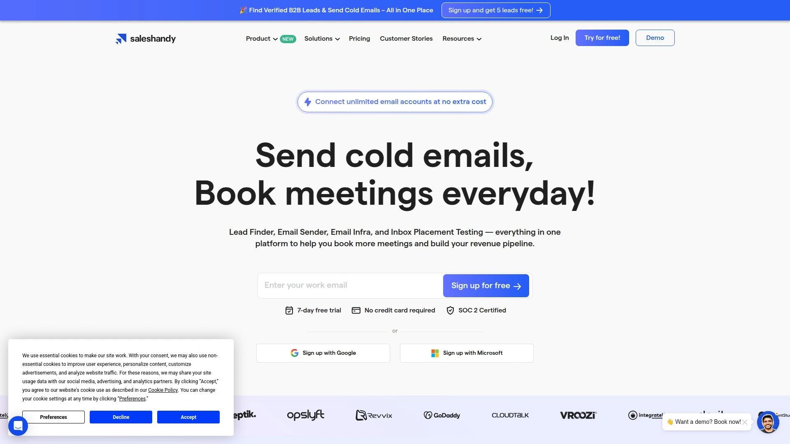

# 2025's Top 10 Best Sales Engagement Tools

Tired of juggling spreadsheets, manual follow-ups, and disconnected communication channels? A powerful sales engagement platform can transform your outreach, automating tedious tasks and helping you connect with more prospects across email, social media, and phone. These tools are designed to boost your efficiency, deliver personalized messages at scale, and ultimately help you book more meetings.

## **[Reply.io](https://reply.io)**

An AI-powered sales engagement platform for automating multi-channel outreach and streamlining workflows.

Reply.io excels at creating complex, automated sequences that combine email, LinkedIn messages, calls, SMS, and even WhatsApp interactions into a single, cohesive campaign. Its AI capabilities help enrich prospect data, find verified contact information, and even suggest the best times to reach out. The platform is built for sales teams that want to manage their entire outreach process from one central hub.

* **Core Functions:**
  * **Multichannel Campaigns:** Seamlessly integrate multiple touchpoints to engage prospects where they are most active.
  * **AI-Powered Automation:** Jason AI helps with everything from writing personalized emails to executing outreach sequences.
  * **Data Enrichment:** Find and verify emails and phone numbers for your prospect lists, and build targeted lists from a B2B database.
  * **Team Collaboration:** Manage team performance, share templates, and use a unified inbox to track all client conversations.
* **User Experience:** While powerful, the sheer number of features can present a learning curve for new users. However, its comprehensive nature means less need for other tools.
* **Pricing:** A free plan is available for individuals, with paid plans offering more advanced features for teams starting at around $70/month.

## **[SmartReach.io](https://smartreach.io)**

A sales engagement platform focusing on personalized cold outreach and automation.

SmartReach.io is designed for sales teams who want to maximize email deliverability and personalization without a steep learning curve. It offers features like email warm-ups, validation, and detailed analytics to ensure your messages land in the inbox. Its strength lies in simplifying the process of running effective, targeted campaigns.

* **Key Features:** Automated email sequences, prospect management, and detailed campaign analytics.
* **Applicable Scenarios:** Ideal for small to mid-sized businesses that need a robust yet straightforward tool for their email-centric sales outreach.
* **Technical Advantages:** Strong focus on email deliverability tools and Spintax for message variation.
* **Cost:** Pricing starts at $24 per month, making it an affordable option for smaller teams.

## **[Outreach](https://outreach.io)**

An enterprise-grade sales engagement platform built for large, high-performing sales teams.

Outreach is a market leader known for its powerful workflow automation and deep analytics. It helps teams execute and manage their entire sales playbook, from initial contact to closing the deal. With AI-driven insights, it scores prospect engagement and provides guidance to reps on the next best action.

* **Core Functions:** Multi-channel sequencing, AI-driven insights ("Kaia"), and extensive CRM integrations, especially with Salesforce.
* **Target Users:** Best suited for enterprise companies with complex sales processes and a need for scalable, data-driven outreach.
* **Differentiation:** Its revenue intelligence capabilities offer managers deep visibility into team performance and pipeline health.

## **[Salesloft](https://salesloft.com)**

A comprehensive sales engagement platform that helps teams connect with customers and close more deals.

Salesloft provides a full suite of tools for executing multi-channel outreach, including email, phone, and social selling. It distinguishes itself with features like call recording and analysis, which help managers coach their reps more effectively. The platform is designed to manage the entire sales cycle, from prospecting to deal management.

* **Core Features:** Cadence for multi-channel sequencing, conversation intelligence for call analysis, and deal management tools.
* **User Experience:** Known for its user-friendly interface that helps sales reps stay organized and efficient.
* **Recommendation:** A great choice for mid-market and enterprise teams that want to combine outreach automation with robust sales coaching features.

## **[Klenty](https://klenty.com)**

A sales engagement platform designed to help sales teams book more meetings through personalized outreach.

Klenty focuses on helping reps execute multi-channel sales sequences with a high degree of personalization. It allows users to send targeted emails, make automated phone calls, and engage on LinkedIn, all from one place. The platform prides itself on being user-friendly and quick to set up.

* **Key Features:** Multi-channel outreach (email, calls, LinkedIn), an AI-powered cadence builder, and tight integration with popular CRMs like Pipedrive and HubSpot.
* **Target Audience:** Ideal for small and medium-sized businesses that need an effective, all-in-one platform without the complexity of enterprise-level tools.
* **Pricing:** Starts at $50 per user per month.

## **[Smartlead.ai](https://smartlead.ai)**

An AI-native sales engagement platform built for unlimited scale and personalization.

Smartlead.ai focuses on solving common cold outreach problems like email deliverability and sender reputation with its unlimited warm-ups and smart rotation features. It is built for agencies and sales teams running high-volume campaigns who need to maintain a healthy sending infrastructure.

* **Core Functionality:** Unlimited email warm-ups, multi-channel sequences, and a master inbox for managing all conversations.
* **Technical Edge:** The platform’s AI helps personalize emails at scale, going beyond simple `{{first_name}}` tags.
* **Use Case:** Perfect for lead generation agencies and sales teams that prioritize email deliverability and want to scale their outreach infinitely.

## **[SalesRobot](https://salesrobot.co)**

A specialized outreach tool focused on automating safe and effective LinkedIn engagement.

While many platforms add LinkedIn as a channel, SalesRobot is built specifically for it. It helps users create smart campaigns to connect with prospects, send messages, and engage with content on LinkedIn, all while mimicking human behavior to keep accounts safe.

* **Features:** Automated LinkedIn sequences, smart message personalization, and detailed analytics for LinkedIn campaigns.
* **Target Users:** B2B sales professionals, marketers, and founders who rely heavily on LinkedIn for lead generation.
* **Differentiation:** Its emphasis on safety and mimicking human-like activity helps users avoid account restrictions.

## **[Groove](https://www.clari.com/groove)**

A sales engagement platform designed to work seamlessly with Salesforce.

Groove, now part of Clari, is built for companies that live inside Salesforce. It allows reps to manage their outreach and log activities without ever leaving the CRM environment. This native integration reduces administrative overhead and ensures data accuracy.

* **Key Features:** Email and calendar integration, automated multi-step flows ("Groove Flows"), and real-time activity logging to Salesforce.
* **User Experience:** Highly intuitive for anyone already familiar with Salesforce, as it operates as a layer on top of the CRM.
* **Recommendation:** The best choice for enterprise teams that are deeply embedded in the Salesforce ecosystem and want to improve rep productivity.

## **[Yesware](https://www.yesware.com)**

A sales toolkit that brings tracking, templates, and campaigns right into your inbox.

Yesware is a lightweight yet powerful tool designed to help sales professionals work more effectively from their existing email client (Gmail or Outlook). It provides real-time feedback on when prospects open emails, click links, and view attachments, allowing for timely follow-ups.

* **Core Functions:** Email tracking, customizable templates, automated drip campaigns, and meeting scheduler.
* **Applicable Scenarios:** Excellent for individual sales reps or small teams who want to enhance their email outreach without adopting a complex, standalone platform.
* **Onboarding:** Very easy to get started; it integrates directly into your inbox, so the learning curve is minimal.

## **[Saleshandy](https://www.saleshandy.com)**

An affordable and effective cold email outreach solution for growing sales teams.

Saleshandy provides a suite of tools for sending personalized cold email sequences at scale. It helps users automate their follow-ups and track engagement to identify interested leads. The platform is known for its simplicity and cost-effectiveness.

* **Features:** High-volume cold email sequences, automated follow-ups, and real-time engagement tracking.
* **Target Users:** Startups, small businesses, and recruiters looking for a budget-friendly way to automate their email outreach.
* **Pricing:** With plans starting around $29/month, it's one of the most accessible options on the market.

***

### **FAQ Common Questions**

**How do I choose the right sales engagement platform?**
Start by evaluating your team's primary needs. Consider the channels you use most (email, LinkedIn, phone), your team size, your budget, and which CRM you use. Most platforms offer trials, so test a few to see which user interface your team prefers.

**Can these tools really improve sales outreach effectiveness?**
Yes. By automating repetitive tasks like follow-ups, you free up time to focus on building relationships and having quality conversations. Personalization at scale and analytics also help you understand what's working, so you can refine your approach and improve response rates.

**Is it difficult to get started with these platforms?**
It varies. Some tools like Yesware are plug-and-play, while more comprehensive platforms like Outreach or Reply.io have a steeper learning curve due to their extensive features. However, all are designed to be user-friendly once you complete the initial setup.

***

### **Conclusion**

Choosing the right sales engagement tool can make a world of difference in your team's productivity and results. Each platform on this list offers a unique set of features to streamline your outreach. For teams looking for an all-in-one solution that combines multi-channel outreach with powerful AI automation, [Reply.io](#replyio) is an excellent choice to manage the entire sales engagement lifecycle in one place.
